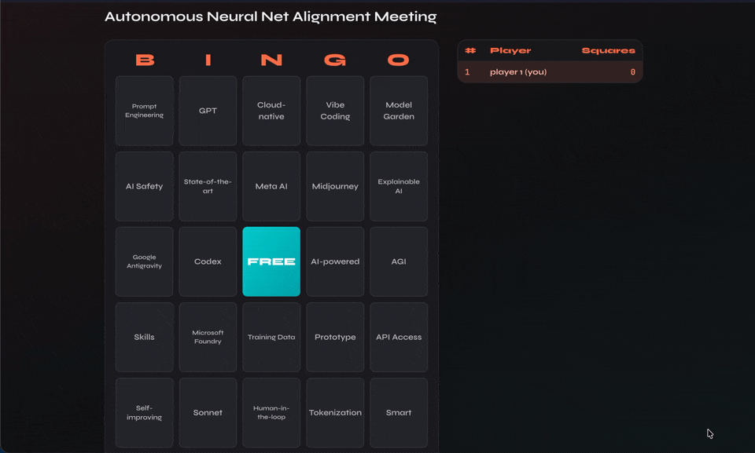

# AI Buzzword Bingo

A real-time multiplayer bingo game for surviving AI-heavy meetings. Create a session, share the code with your team, and race to mark buzzwords as you hear them. When someone marks a word, it marks on **everyone's** board.

<p align="center">
  
</p>

## How It Works

1. **Create a game** and share the 6-character session code (or link) with your team
2. **Join a meeting** — the boring kind, with lots of AI buzzwords
3. **Tap buzzwords** on your board as you hear them — they auto-mark on all players' boards
4. **First to five in a row** (horizontal, vertical, or diagonal) wins

Every player gets a unique randomized board drawn from a shared pool of ~95 buzzwords across categories like technical terms, hype words, company names, AI products, and dev tools.

## Features

- **Real-time multiplayer** via WebSockets (PartyKit) — no polling, instant updates
- **Shared marking** — when you mark a word, it flips on every board that has it
- **Live scoreboard** tracking each player's progress
- **Buzzword ticker** showing called words with neon animations
- **Confetti celebration** and over-the-top AI-themed win messages
- **Shareable join links** — one click to join a session
- **Mid-game join** — late players auto-catch-up on already-called words
- **Mobile-friendly** — works on phones, tablets, and desktops

## Tech Stack

| Layer | Technology |
|---|---|
| Frontend | React 18, Tailwind CSS, Vite |
| Real-time server | [PartyKit](https://www.partykit.io/) (Cloudflare Durable Objects) |
| WebSocket client | [PartySocket](https://www.npmjs.com/package/partysocket) |
| Hosting | Vercel (frontend) + PartyKit (server) |
| Effects | canvas-confetti |

## Getting Started

### Prerequisites

- Node.js 18+ or Bun
- A [PartyKit](https://www.partykit.io/) account (free tier)

### Local Development

```bash
# Install dependencies
npm install

# Start the PartyKit server (runs on localhost:1999)
npm run party:dev

# In a separate terminal, start the Vite dev server
npm run dev
```

Copy `.env.example` to `.env` and set the PartyKit host:

```
VITE_PARTYKIT_HOST=localhost:1999
```

### Deploy

**PartyKit server:**

```bash
npm run party:deploy
```

**Frontend (Vercel):**

Push to your connected GitHub repo — Vercel builds automatically. Set the `VITE_PARTYKIT_HOST` environment variable in your Vercel project settings to your deployed PartyKit URL (e.g. `ai-buzzword-bingo.yourname.partykit.dev`).

## Project Structure

```
├── party/
│   └── index.ts          # PartyKit server — game state, WebSocket handlers, win detection
├── src/
│   ├── components/
│   │   ├── LandingPage.jsx    # Create/join game UI
│   │   ├── Lobby.jsx          # Pre-game waiting room
│   │   ├── GameBoard.jsx      # Main game view with scoreboard
│   │   ├── BingoSquare.jsx    # Individual square with flip animation
│   │   └── BuzzwordTicker.jsx # Bottom ticker showing called words
│   ├── hooks/
│   │   └── usePartySocket.js  # WebSocket connection and message handling
│   ├── lib/
│   │   ├── buzzwords.js       # Word list, session name generator, win messages
│   │   └── boardGenerator.js  # Randomized board generation with shared pool
│   ├── App.jsx               # Root component, view routing, game logic
│   ├── main.jsx
│   └── index.css             # Tailwind + custom animations
├── partykit.json
├── vercel.json
└── package.json
```

## License

MIT
